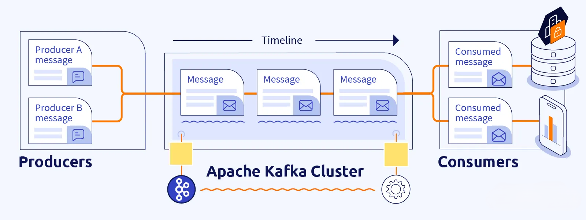
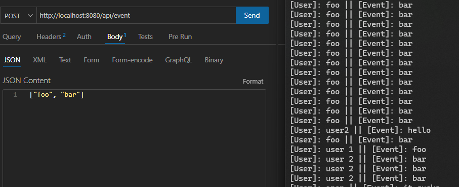

# Kafka

## Definition
Apache Kafka is an open-source distributed event streaming platform designed for high-throughput, low-latency data processing. It serves as a unified platform for handling real-time data feeds.

### Some Features
- **Event Streaming**: Kafka allows applications to publish and subscribe data to stream of records, storing them and process afterwards;
- **High Throughput**: Kafka can handle large volumes of data with least possible delay, making it suitable for real-time data processing;
- **Scalability**: Kafka scales horizontally by adding brokers to the cluster, handling high volumes of data without trading off its performance;
- **Reliability**: It stores data ensuring that messages won't be lost even in failure scenarios. The data redundancy across multiple brokers provides high availability.

### Diagram
The diagram below shows how producers send messages to the Kafka cluster, which stores and distributes them to consumers for processing. This architecture is commonly used in real-time data processing, event-driven systems, and other applications where data needs to be distributed and processed efficiently. The major components in the diagram includes:
- **Producers**: Applications that publish messages to Kafka topics and generate messages;
- **Consumers**: Applications that subscribe to topics and process the published messages from Producers;
- **Apache Kafka Cluster**: Distributed system queue that stores and manage messages. It contains multiple brokers that work together to provide reliability, throughput and scalability. 



## Build
Firstly, ensure you have Docker installed and running.

### For Windows Users
Kafka installation is a little bit tricky, follow [these steps](https://medium.com/@sumanthshastry/install-kafka-zookeeper-using-docker-container-in-windows-7abbddbde0be) accordingly to enable kafka binaries.

### Initialize docker-compose
`docker-compose up -d --build`

### Init kafka-console-consumer
1. Open CMD
2. Run 
```
kafka-console-consumer.bat --bootstrap-server localhost:9092 --topic <topic name> --from-beginning
```
**For example**: --topic click-events

## Demonstration
Local test using a REST client sending a pair of strings to a specific topic as a producer and Kafka-Console as consumer.
